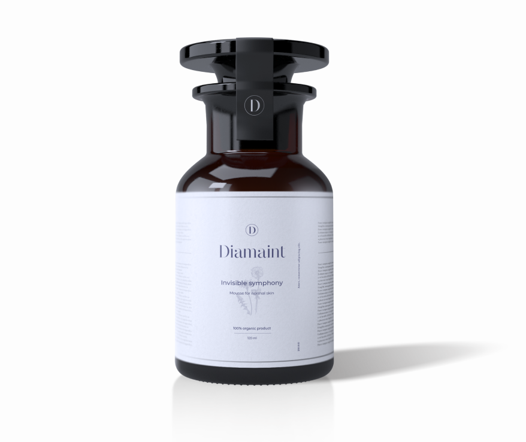

<!DOCTYPE html>
<html lang="en">

<head>
    <meta charset="UTF-8">
    <meta name="viewport" content="width=device-width, initial-scale=1.0">
    <title>Document</title>
</head>

<body>
    <h1>Выбери свой продукт</h1>
    

        
        <h3>для нормальной кожи</h3>
        <h2>Увлажняющий мусс</h2>
        
Глубоко увлажняют кожу лица, оставляя её мягкой и гладкой.

        <h4></h4>
        <ul>Состав:
            <li>активные натуральные комплексы</li>
            <li>витамины С, А, РР, В И Е</li>
            <li>солнцезащитные компоненты</li>
        </ul>
        <b>Цена </b>
        2 750 ₽
    

    

    

    

    

</body>

</html>
